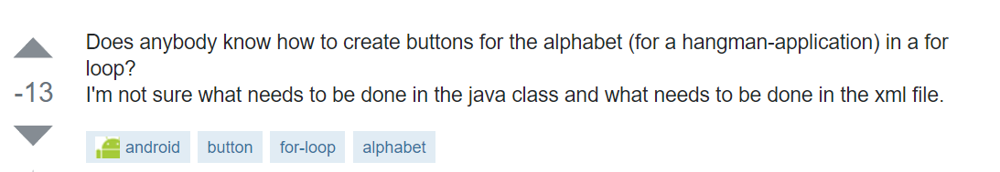
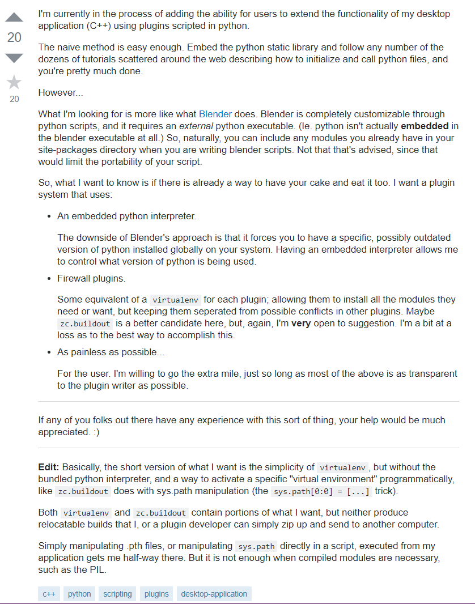

Everyone says that there's no dumb question but I know for a fact that there is a smart way to ask questions. So why is it important for us, software engineers to ask smart questions? The answer is very simple. People want to know that you aren’t bluffing your way through this but also that you are not wasting their time. No one likes wasting time, heck you don’t like wasting time so why would you ask a question that can waste someone else’s time. Another reason is that by asking a smart question you are saving time. The person answering your question would not know what you have done unless you tell them. You could have already tired what they suggested and if you don’t put that, they wouldn’t know and it would be redundant. Waste time = waste money and in this world, we don’t like wasting money.

## Stack Overflow: Programming Questions

As a software engineer, my best friend is Stack Overflow. There’s Googlers out there and there’s stack Overflowers. I consider myself a Stack Overflower. You might be intrigued to ask me, “So? What is Stack Overflow?” Stack Overflow is a website where people can ask questions and receive help on programming topics. There are a wide range of questions from beginner questions to advance questions and these questions are answered by skilled programmers who volunteer their little time to give insight to us little birdies calling for help. While majority of the question on Stack Overflow are good questions, there are some bad ones that just don’t past the test of the all mighty themselves. 

Here is an example of a bad question. This question can be found on Stack Overflow [here](https://stackoverflow.com/questions/18871030/android-how-can-i-set-up-buttons-in-a-for-loop)

One can argue though, “This question was answered! It can’t be a bad question!” Now hold it right there, there are many reasons that this is a bad question but the most important thing is that it lacks specific details. To get a good answer and good feed back, a question should not only ask the question but should provide background information on what you have already done. As I have said before you don’t want redundancy. You don’t want the person that is answering your question to waste their time but you also don’t want them to waste your time. If they provide an answer that you have already tried then the reason you asked the question is no longer valid, but they do not know that you have tried it unless you say so. 

Now, let me show you an example of a good question that can be found [here](https://stackoverflow.com/questions/3374801/the-right-way-to-add-python-scripting-to-a-non-python-application) 

This question is way different from the first one. It not only asks a question but it provides a lot of insight as what the programmer has done already. They also explain what they understand so specifically what they need so that the person helping them is capable to answer the question fully with their knowledge.

## Good Engineers Make Good Questions (and vice versa)

As engineers, we owe it to ourselves to ask each other good questions. When we ask good questions, we can get meaningful answers in return that can lead to engaging conversation. If you want to read more about the differences between good and bad questions, I highly recommend giving Eric Steven Raymond’s [article](http://www.catb.org/esr/faqs/smart-questions.html#explicit)  on “How To Ask Questions The Smart Way” a read.
