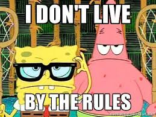

Standards are made so that everyone does the same thing! Isn’t that right? Rules are made to be followed and as all good citizens of the USA we follow all the rules. But one might argue that rules are made to be broken. Of course there are the rules but why do they exists if its not meant to be broken? Well I guess that takes us to how rules and standards differ. They may seem like the same thing to you but they indeed can be very different. Like I have said before, standards are what are standards. They make things standard. They set the rules for the rules.

Having a coding standard is important so that everyone in the coding world knows how to read and write code for everyone else to read and understand. Coding itself is already hard to understand and can be difficult to read when you are not super proficient at reading code or is new to coding. The coding standards make it so that even novice coders can understand a expert coders work. Some might say that some coding standards can actually help you learn a programming language and I would have to agree, coding standards are different for every different language and it can help you understand what you are missing and what you still need in that language. Like in Python there is no need for a semi-colon at the end of each line of code but in java-script and C 
