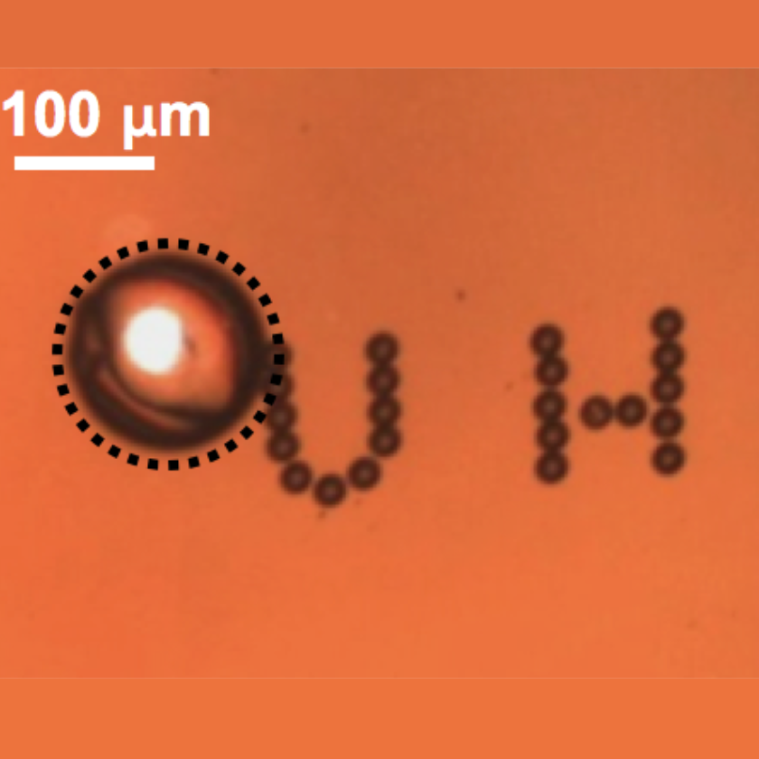
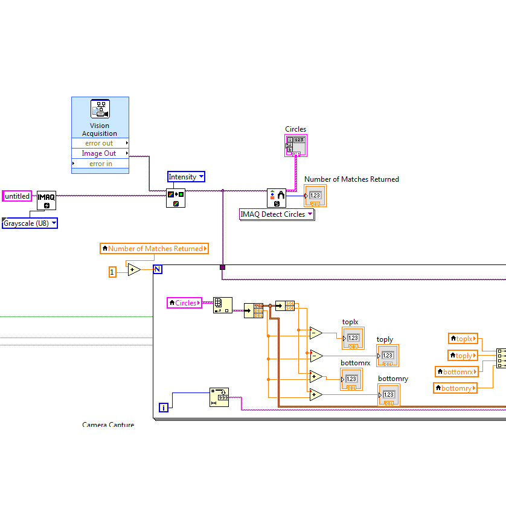
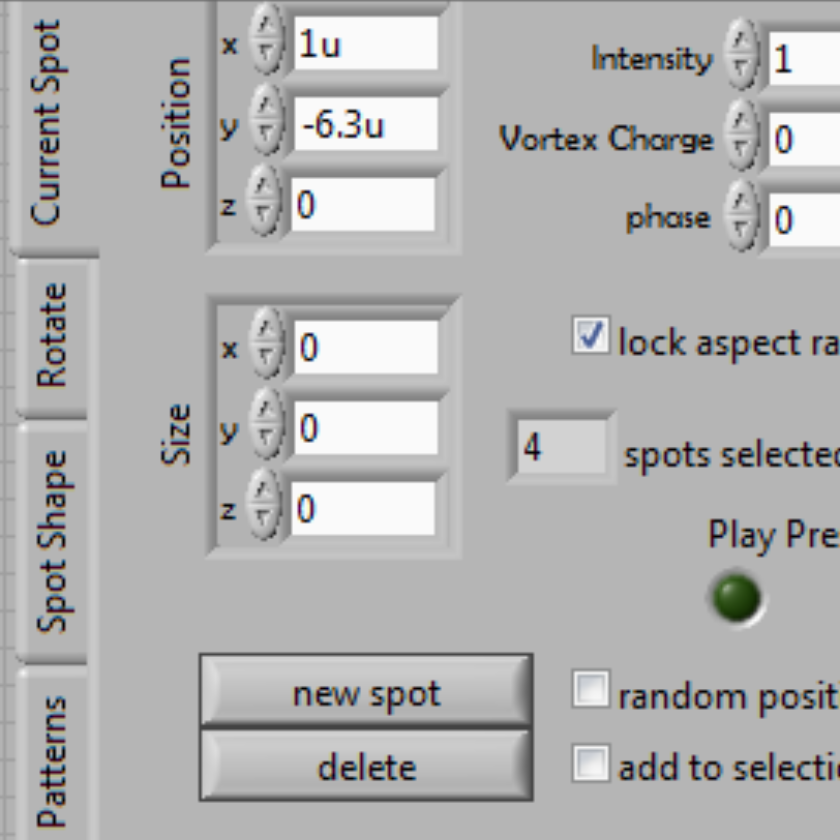

  
  
  
  

The problem of organ transplant rejection rates are high and that's where microrobots can come into help. The purpose of this project is to create aritfical organs in the end from a patients own cells. The Microrobotics Vertically Integrated Project at University of Hawaii at Mānoa has developed robots that operate on a microscopic scale that can be used to move around objects of the same scale, therefore they are ideally able to control the location of cell growth and help grow tissue and organs. These robots are used in research projects in which they are controlled by lasers operated by a computer program. 

For this project, I was the lead programmer who was responsible for programming the various functionalities of the program to control the microrobots. The program that was used was recently written from another University and professor that specialized in optical tweezers. Our teams was tasked with implementing functions to fully optimizze the program for full control of the microrobots that we made. I started by programing an image processing module for the program so that the program can capture the image under the microscope and the user would be able to tell the robots where to go. I first started with the captured image from the microscope. Then using some of the features in Labview, the image is then passed through and intensified and returns an image that identifies where the robot is. After this the identification of the robot is noted by the computer by the pixels and axis of it's location. From there the program is able to move the robot into a new potion if it needs by the user.  The project is a vertically integrated project which means that it is an on-going project within the semesters at the University of Hawaii. We will be working on implementing another module which tells the robots what shapes to form to surround an object called caging. 

You can learn more at the [UH Microdevices & Microfluidics Lab](http://ee.hawaii.edu/~aohta/research.html).

