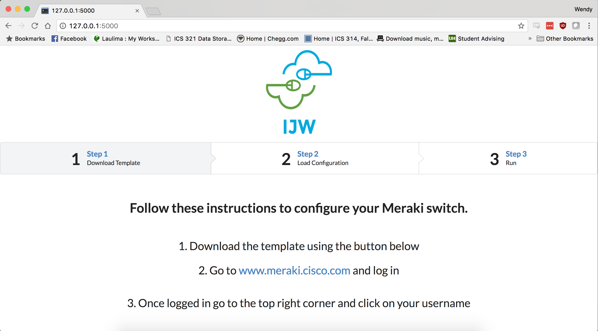

Meraki Bulk Configuration is a web application that I helped create as a team project at World Wide Technology as a intern in Summer 2017. The project helped me learn how to design incorperate Python scripting into a web application.

Vacay is implemented using [Flask] (http://flask.pocoo.org/), a microframework for Python. Within three weeks, we created a website that implements configuration of multiple switches with one click .

In this project I gained experience with full-stack web application design and associated technologies, including the Flask Framework for the user interface and linking pages within HTML and Python, and Python for both client and server-side programming. From downloading configuration in an excel file. You can change the configurations, then uploaded to the site and with the click of one button, all the configirations are then loaded onto your network switch. 
 
Source: <a href="https://github.com/storybook808/Meraki-Bulk-Configuration-Tool"> <i class="large github icon"> </i>Meraki-Bulk-Configuration-Tool</a>
