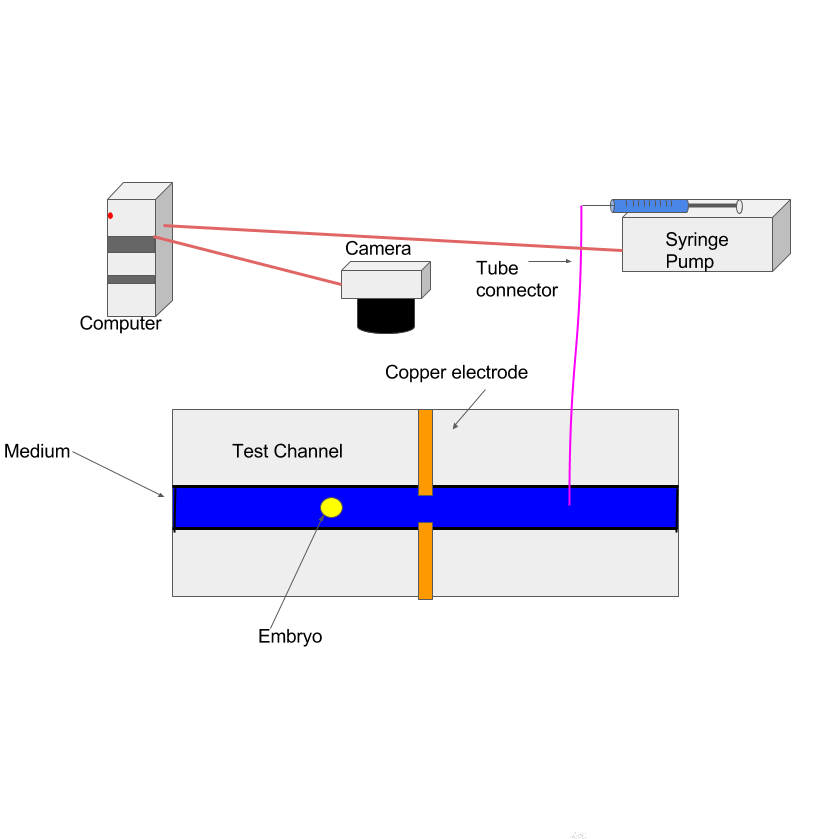
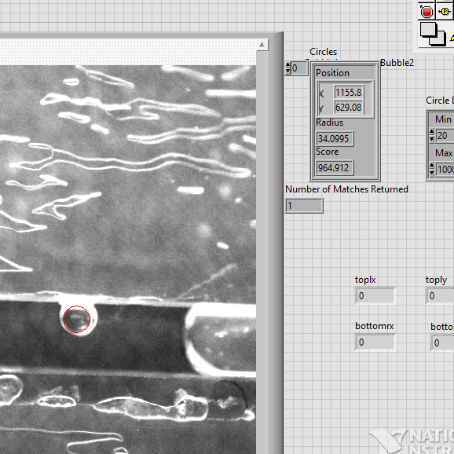
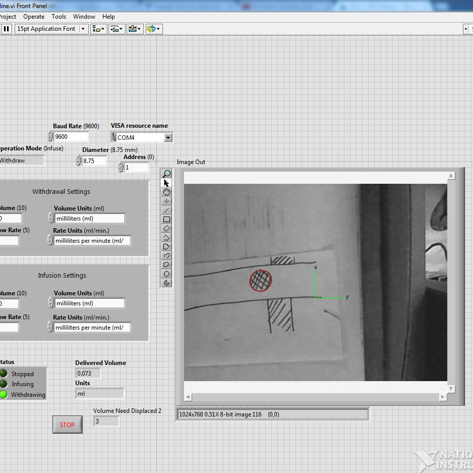

<

  
  
  

In vitro Fertilization (IVF) is becoming an increasingly popular option for couples and mothers who struggle with fertility. While birth rates are declining in the US, births from IVF have been increasing. Even thouhg IVF has empowered many infertile couples to procreate, it lacks a reliable method of predicting the success of an embryo, which has negatively affected the success rate of the operation. The current method of determining the health of an embryo is very arbitrary. This purpose of this project was to create a more successful way of determining the health of an embryo though microfrabrication and programming. 

For this project, I was the lead programmer who was responsible for creating a program that will control a hardware that is connected through a frabraicated cannel that will read the embryo and tell us its health. I started the program by creating setting up parameters for the hardware which included user inputs to the device. Then using image processing we were able to create a module to track where the embryo was and return the postion it needed to be moved to. The image processing then returns a function that tells us how much the hardware needs to move. The program is able to continue moving the embryo through image processing and the feedback it gets after every loop to correctly tell the program to stop the hardwhere when the embryo is in the right place. 

You can learn more at the [UH Microdevices & Microfluidics Lab](http://ee.hawaii.edu/~aohta/research.html).

